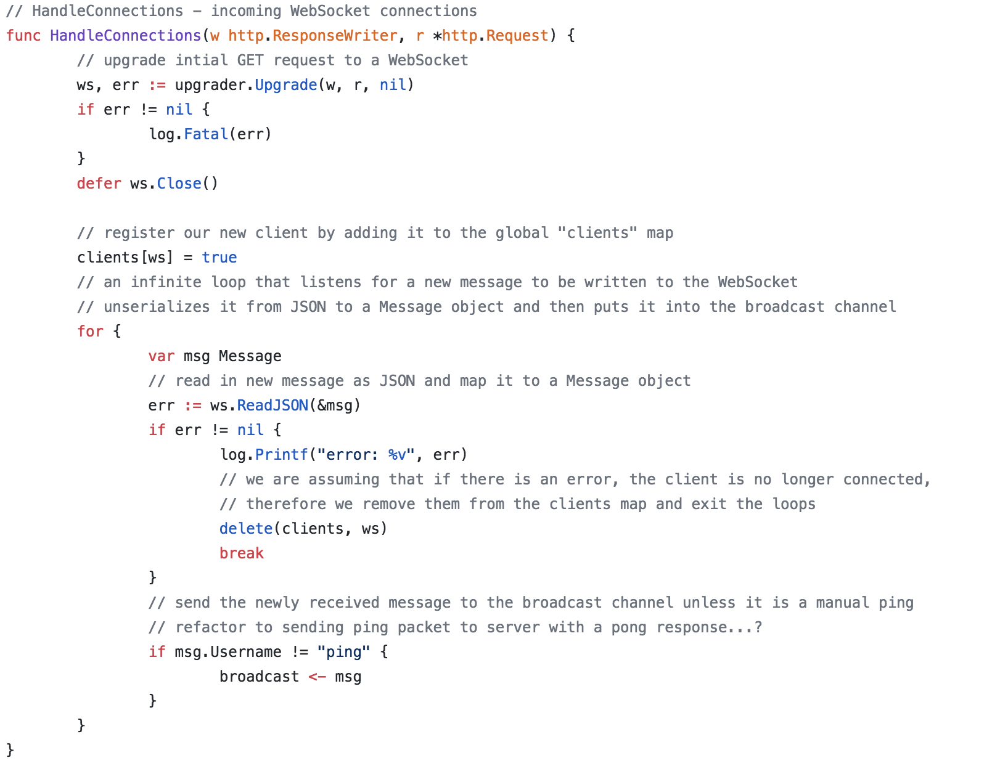
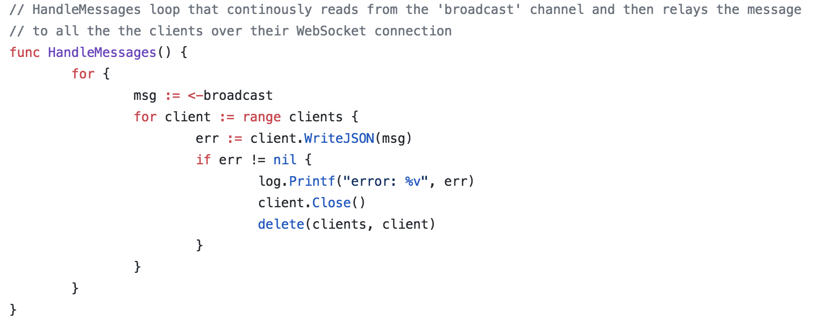

# go chat - [live](http://go-chat-beta.herokuapp.com/#/)

current live version is a simple chat app with one chat room. a party chat. 

## Getting Started...

- go get "github.com/gorilla/websocket" in root
- go run *.go in root
- npm install --save in frontend folder
- webpack --watch in frontend folder

## Technologies 

- websockets  with "github.com/gorilla/websocket" pkg
- golang backend
- react/redux frontend

## Golang Backend

#### see my code comments for how I handled incoming websocket connections in the websockets.go file

## Future Additions

- user authentication
- chat channels
- users can invite friends to a chat room by email, even if they don't have an account
- encrypt all messages
- ability to delete messages after a set amount of time
